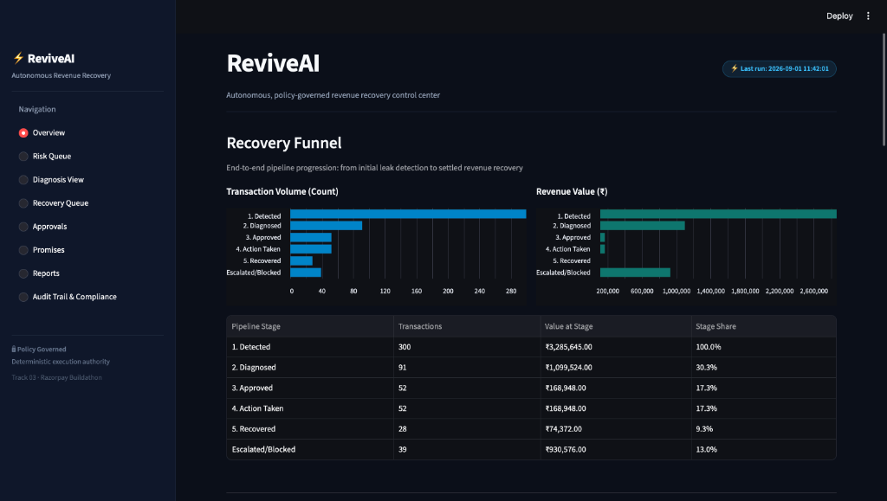
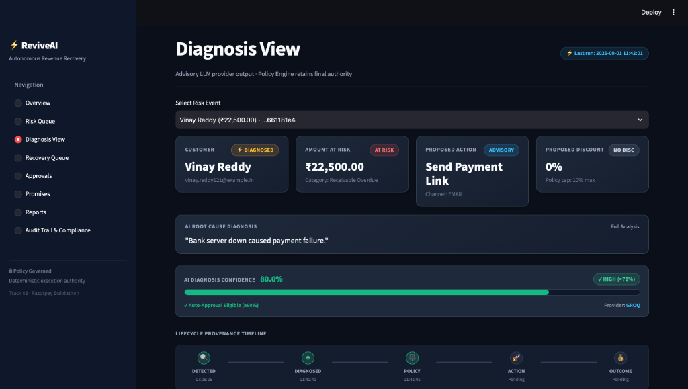
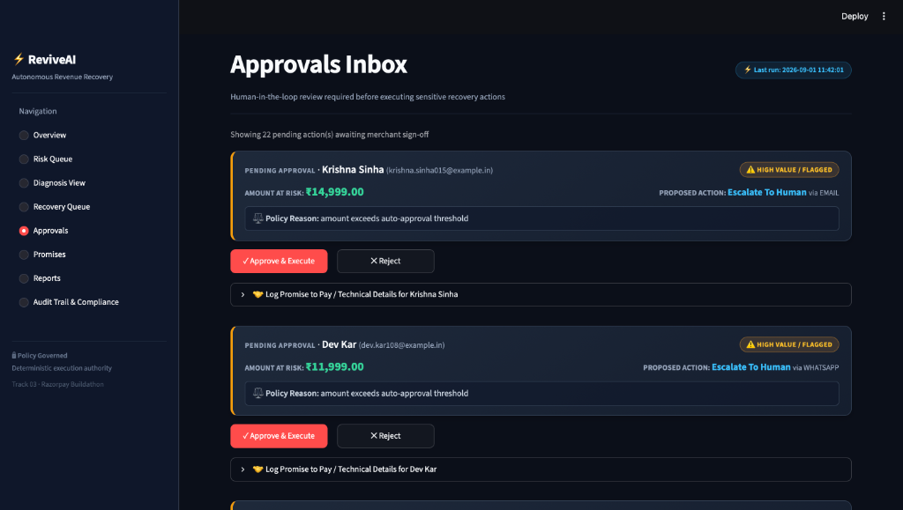
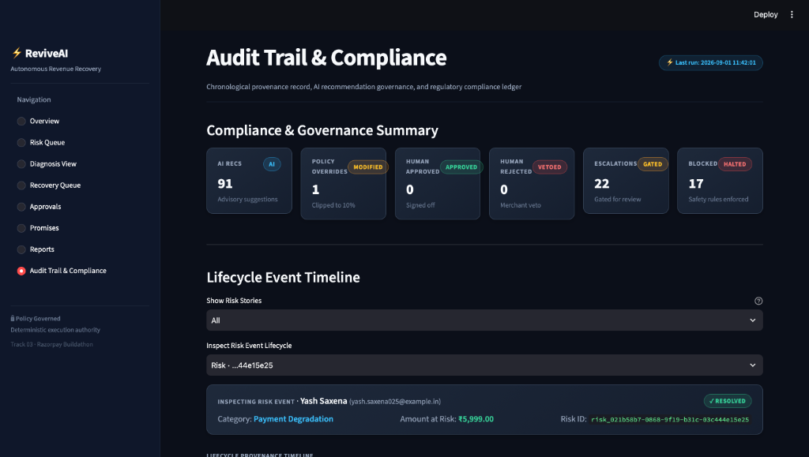

# ⚡ ReviveAI — Autonomous, Policy-Governed Revenue Recovery Agent
> **Razorpay Buildathon · Track 03: AI Revenue Recovery**  
> *Find revenue that’s slipping away, diagnose root causes, and execute bounded recoveries with zero financial hallucination.*

<div align="center">

[](https://www.python.org/)
[](https://razorpay.com)
[](https://streamlit.io)
[](https://groq.com)
[](https://aistudio.google.com)
[](tests/)
[]()

</div>

---

## 🎯 The Problem: Why Revenue Slips Away

Digital merchants silently bleed **10% to 20% of GMV** across 4 critical failure points:
1. **Gateway Payment Degradation**: Bank server downtime, OTP timeouts, and network glitches cause payment attempts to fail.
2. **Checkout Abandonment**: Shoppers drop off at the final payment step due to friction or payment method mismatch.
3. **Failed Subscriptions & Mandates**: Recurring card mandates fail due to expired debit/credit cards or insufficient balances.
4. **B2B Receivables Overdue**: Invoices go unpaid for weeks without automated, structured escalation.

### 🚫 Why Naive AI Bots Fail
Allowing an unconstrained LLM to talk to customers and issue discounts leads to **catastrophic financial and brand risks**:
- **Hallucinated Discounts**: AI offering 50–80% off without margin awareness.
- **Compliance Violations**: Spamming users who explicitly opted out or messaging outside permitted hours.
- **Race Conditions**: Triggering double-refunds or duplicate payment links.

### 💡 The ReviveAI Solution
ReviveAI solves this with a **Dual-Layer Architecture**:
- **Advisory LLM Layer (Groq / Gemini)**: Analyzes failure telemetry, identifies root cause, and drafts culturally natural **Hinglish** recovery copy.
- **Deterministic Policy Engine (Python & SQLite)**: Retains **100% final decision authority**. Enforces hard compliance rules (opt-outs, frequency caps, discount ceilings, and human review gating) before any action is executed.

---

## 1. Architecture Overview

ReviveAI enforces a strict separation between probabilistic reasoning (LLM) and financial execution authority (deterministic Policy Engine). The LLM advises; the Policy Engine decides.

```
+-----------------------------------------------------------------------------------+
| 1. DETECTION ENGINE (Deterministic)                                               |
|    Payment Degradation | Checkout Abandonment | Failed Mandates | Overdue Invoices|
+-----------------------------------------+-----------------------------------------+
                                          |
                                          v
+-----------------------------------------------------------------------------------+
| 2. DIAGNOSIS AGENT (Advisory-Only LLM)                                            |
|    Dual Provider Adapter: Groq (Llama-3.3-70b) / Gemini 2.5 Flash / Fallback      |
|    Outputs typed JSON diagnosis: root cause, suggested action, Hinglish copy      |
+-----------------------------------------+-----------------------------------------+
                                          |
                                          v
+-----------------------------------------------------------------------------------+
| 3. POLICY ENGINE (Deterministic Final Authority)                                  |
|    [Gate 1] Opt-out Check (Hard stop if opted_out = 1)                             |
|    [Gate 2] Frequency Cap (Max 3 contacts / 7 days)                                |
|    [Gate 3] Cooldown Window (24h cooldown per risk)                               |
|    [Gate 4] Max Attempts (Cap at 3 attempts)                                      |
|    [Gate 5] High-Value Escalation (Require merchant review if > ₹15,000)          |
|    [Gate 6] Low-Confidence Escalation (Require merchant review if < 60%)          |
|    [Gate 7] Discount Ceiling (Hard clip at 10.0% max)                             |
+-----------------------------------------+-----------------------------------------+
                                          |
                                          v
+-----------------------------------------------------------------------------------+
| 4. ACTION EXECUTOR & IDEMPOTENCY GUARD                                            |
|    Unique DB constraints prevent duplicate dispatch; defense-in-depth opt-out     |
|    Optional Live Integration: Real Razorpay Test Mode Payment Links API           |
+-----------------------------------------+-----------------------------------------+
                                          |
                                          v
+-----------------------------------------------------------------------------------+
| 5. PROMISE-TO-PAY & OUTCOME TRACKER                                               |
|    Customer commitment tracking + auto-escalation of overdue broken promises      |
+-----------------------------------------+-----------------------------------------+
                                          |
                                          v
+-----------------------------------------------------------------------------------+
| 6. IMMUTABLE AUDIT TRAIL                                                          |
|    Append-only SQLite ledger storing input/output JSON snapshots per lifecycle    |
+-----------------------------------------------------------------------------------+
```

---

## 2. Trust Boundary Matrix

| Component | Role | Execution Authority |
| :--- | :--- | :--- |
| **LLM (Gemini / Groq)** | Diagnoses root cause, proposes an action, writes Hinglish copy | **None** — outputs typed JSON only, cannot write to the DB or trigger any message |
| **Policy Engine** | Gating & decisioning | **Absolute** — overrides, clips, blocks, or escalates any LLM proposal against hard business rules |
| **State Store (SQLite)** | Idempotency & persistence | **Absolute** — a lock + unique constraint physically prevents double-execution |
| **Action Executor** | Physical dispatch (simulated or live link) | **Execution only** — dispatches exactly what the Policy Engine approved |
| **Streamlit UI / Human** | Operator console | **Read + Approve/Reject only** — signs off on gated actions |
| **Audit Log** | Chronological provenance record | **Immutable History** — append-only record of every stage's inputs and outputs |

---

## 3. Why the LLM Never Acts Alone

In financial workflows, granting an unconstrained LLM execution authority over customer communications and discounting creates severe compliance, financial, and churn risks. ReviveAI enforces deterministic safety rules in pure Python code (`policy/policy_engine.py`) using exact merchant thresholds:

1. **Opt-Out Respect (`opt_out_respect`)**: If `customer.opted_out == 1`, execution is unconditionally **BLOCKED** (`reason: "customer opted out"`).
2. **Frequency Cap (`max_contact_frequency`)**: Maximum **3 recovery contacts per customer per 7-day window**. Blocked if exceeded.
3. **Cooldown Period (`cooldown_hours`)**: Minimum **24 hours** between consecutive recovery actions on the same risk event.
4. **Max Attempts Limit (`max_attempts`)**: Caps at **3 recovery attempts** per risk event before marking the risk as `expired`.
5. **High-Value Threshold (`approval_threshold_amount`)**: Any recovery action on amounts exceeding **₹15,000.00** mandates human approval.
6. **Low-Confidence Threshold (`confidence_threshold`)**: Diagnoses with LLM confidence **< 0.60 (60%)** automatically escalate to human approval.
7. **Discount Ceiling (`discount_cap`)**: Hard ceiling of **10.0%** that automatically clips any higher LLM discount proposal (`decision = "modified"`).
8. **Broken Promise Escalation (`force_escalate`)**: Overdue promises-to-pay automatically bypass auto-approval and require manual review.

---

## 4. Provider-Agnostic LLM Layer

The Diagnosis Agent implements an abstract `LLMProvider` interface (`diagnosis/base_provider.py`) with adapters for **Groq** (`llama-3.3-70b-versatile`) and **Google Gemini** (`gemini-2.5-flash`).

- **Configurable Runtime Selection**: Switch between providers anytime via `LLM_PROVIDER=groq` or `LLM_PROVIDER=gemini` in `.env`.
- **Automatic Fallback Chain**: If the primary provider encounters a rate limit, timeout, or auth error, the system logs the incident to `audit_log` and immediately attempts diagnosis via the secondary provider.
- **Fail-Safe Offline Mode**: If both providers are unavailable or credentials are omitted, the agent emits a deterministic fallback diagnosis (`reason: "LLM diagnosis unavailable - routing to human review"`), preventing pipeline crashes.

---

## 5. Setup & Execution Guide

### Prerequisites
- Python 3.10+
- macOS / Linux / Windows

### 1. Installation
```bash
git clone https://github.com/jas127/razorpay-reviveAI.git
cd razorpay-reviveAI
python3 -m venv venv
source venv/bin/activate
pip install -r requirements.txt
```

### 2. Environment Configuration
Copy `.env.example` to `.env` and configure your API keys:
```bash
cp .env.example .env
```
Edit `.env`:
```ini
LLM_PROVIDER=groq
GROQ_API_KEY=gsk_your_key_here
GEMINI_API_KEY=your_key_here

# Optional: Live Razorpay Test Mode Checkout Link Generation
USE_REAL_RAZORPAY_LINKS=false
RAZORPAY_KEY_ID=rzp_test_your_id_here
RAZORPAY_KEY_SECRET=your_secret_here
```

### 3. Database Initialization & Seeding
```bash
python db/init_db.py --reset
python db/seed_data.py
```

### 4. Running the Pipeline via CLI
Execute each pipeline stage sequentially:
```bash
python detection/run_detection.py
python diagnosis/run_diagnosis.py
python policy/run_policy.py
python executor/run_executor.py
```

### 5. Launching the Control Center Dashboard
```bash
streamlit run app.py --server.port 5000
```
Open **http://localhost:5000** in your browser.

---

## 6. Sample Run Benchmark Results

The following metrics reflect an end-to-end execution of ReviveAI on the deterministic 300-event benchmark dataset (`revive.db`):

| Metric | Measured Value | Description |
| :--- | :--- | :--- |
| **Total Portfolio at Risk** | **₹3,285,645.00** | 300 detected risk events across 4 failure categories |
| **Auto-Approved Action Volume** | **₹168,948.00** | Volume vetted and dispatched under strict policy approval (52 actions) |
| **Total Recovered Revenue** | **₹74,372.00** | Converted recoveries resulting in captured payments (28 paid outcomes) |
| **Action Success Rate** | **53.85%** | Percentage of executed recovery actions resulting in payment (28 / 52) |
| **Action Volume Recovery Rate** | **44.02%** | Proportion of auto-approved ₹ volume successfully recovered |
| **Portfolio Recovery Rate** | **2.26%** | Recovered ₹ as a fraction of total ₹ at risk *(see explanation below)* |
| **Policy Decisions Breakdown** | • `auto_approved`: 51<br>• `needs_human_approval`: 22<br>• `blocked`: 17<br>• `modified`: 1 | Breakdown of deterministic policy gate results |
| **Pending Human Approvals** | **22 sensitive/high-value cases** | **₹1,824,500.00** volume safely held in merchant review queue |

> **Explanation of Action Success Rate vs. Portfolio Recovery Rate**:
> ReviveAI achieves a **53.85% action conversion rate** on events it was authorized to contact. The portfolio recovery rate of 2.26% reflects deliberate risk control: **22 high-value and sensitive risk events totaling over ₹1.8M** are safely held in the Human Approval Queue rather than auto-dispatched, and **17 events** were blocked by opt-out or frequency limits.

---

## 7. Proven Safety Properties & Test Suite

The test suite covers idempotency, race condition prevention, opt-out enforcement, discount clipping, and external API error handling:

```bash
pytest -v
```

### Automated Test Matrix (19 Passing Tests):
- `tests/test_opt_out_enforcement.py`:
  - `test_opt_out_policy_blocks_unconditionally`: Verifies opted-out customers are blocked unconditionally by the policy engine.
  - `test_executor_defense_in_depth_blocks_opted_out_even_if_forged`: Proves that even if an invalid `auto_approved` row is forged, the executor physically refuses to dispatch.
- `tests/test_idempotency.py`:
  - `test_concurrent_duplicate_trigger`: Simulates concurrent detection triggers for identical events; verifies exactly 1 risk event is created.
  - `test_stale_lock_sweep`: Verifies abandoned locks (>5m) are safely swept back to diagnosed state with `force_escalate=1`.
  - `test_duplicate_executor_call`: Verifies database unique constraints prevent double-messaging.
- `tests/test_policy.py`:
  - `test_policy_seeds_defaults_and_stops_at_opt_out`: Validates default policy seeding and opt-out blocking.
  - `test_policy_blocks_frequency_cooldown_and_attempts`: Tests 7-day frequency caps, 24h cooldown, and 3-attempt limits.
  - `test_policy_human_thresholds_and_discount_modification`: Verifies high-value escalation (>₹15k) and discount capping to 10%.
  - `test_policy_force_escalate_overrides_confidence`: Proves `force_escalate` overrides high confidence.
- `tests/test_phase6.py`:
  - `test_hinglish_prompt_and_storage`: Validates Hinglish prompt generation and storage.
  - `test_promise_to_pay_logging_and_escalation`: Validates promise-to-pay logging and auto-escalation of overdue commitments.
- `tests/test_razorpay_integration.py`:
  - `test_razorpay_client_fallback_on_missing_keys`: Verifies graceful simulation fallback when credentials are absent.
  - `test_razorpay_client_success_mock`: Validates Razorpay Payment Links payload generation and short URL extraction.
  - `test_executor_with_use_real_razorpay_links_enabled`: Verifies `simulated=0` flag and live URL storage.
  - `test_executor_with_use_real_razorpay_links_disabled`: Verifies standard template generation when toggle is off.
- `tests/test_executor.py`:
  - Validates contact count increments and deterministic outcome simulation.

---

## 8. User Interface Screenshots

### Overview & Recovery Funnel

*Figure 1: End-to-end recovery funnel showing transaction volume progression and value recovered across pipeline stages.*

### Diagnosis View & Hinglish Outreach

*Figure 2: Advisory diagnosis view showing AI root cause, confidence meter, timeline widget, and generated recovery copy.*

### Approvals Inbox & Policy Gating

*Figure 3: Human-in-the-loop merchant approval inbox for high-value and sensitive recovery interventions.*

### Audit Trail & Compliance Provenance

*Figure 4: Immutable audit log and compliance summary showing policy overrides, safety blocks, and lifecycle state transitions.*

---

## 9. Simulation Boundary & Production Integration Note

In this MVP:
- **Simulated Components**: Message dispatch (Email, SMS, WhatsApp) and customer behavioral outcome responses are deterministically simulated (`simulated = 1` recorded in database).
- **Optional Live Integration**: Payment link generation supports Razorpay's real Test Mode API (`POST https://api.razorpay.com/v1/payment_links`), toggleable via `USE_REAL_RAZORPAY_LINKS=true`. When active, real payment links (`https://rzp.io/...`) are created and marked `simulated = 0`.

### Production Deployment Architecture:
1. **Detection**: Ingest live Razorpay Webhooks (`payment.failed`, `subscription.charged.failed`, `invoice.overdue`).
2. **Execution**: Dispatch messages via Razorpay Payment Links API / WhatsApp Business Platform / Twilio.
3. **Outcomes**: Subscribe to Razorpay `payment.captured` and `order.paid` webhooks to automatically mark risks as `resolved`.

---

## 10. Tech Stack

- **Core Logic**: Python 3.10+, SQLite3 with `BEGIN IMMEDIATE` concurrency control
- **AI & LLM**: Groq SDK (`llama-3.3-70b-versatile`), Google GenAI SDK (`gemini-2.5-flash`)
- **Web UI & Dashboard**: Streamlit, Pandas, Altair / Vega-Lite
- **Testing & Verification**: Pytest, Unittest Mock
- **External Gateway**: Razorpay Test Mode Payment Links API

